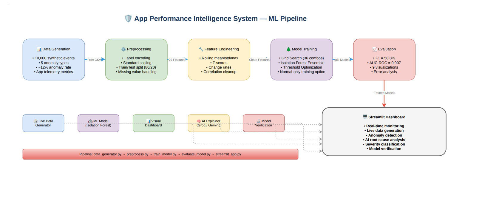

# 🛡️ App Performance Intelligence System

ML-based anomaly detection for mobile app performance monitoring with a real-time SaaS dashboard, User Authentication, historical database tracking, and AI-powered root cause analysis.


---

## 🎯 What It Does

Operating as a Multi-Tenant SaaS platform, this system detects anomalies in mobile app telemetry (API latency, FPS, memory, errors) using an Isolation Forest ML model. It features secure user authentication, automatically logs anomalies to a cloud PostgreSQL database, and explains root causes using AI.

**5 Anomaly Types Detected:** Memory Leak · Latency Spike · FPS Drop · Error Burst · API Timeout

---

## 🏗️ Pipeline



---

## 🚀 Quick Start
```bash
# Clone
git clone https://github.com/yourusername/app-performance-intelligence-system.git
cd app-performance-intelligence-system

# Install dependencies
pip install -r requirements.txt

# Set up Streamlit Secrets (for DB & AI)
# Create .streamlit/secrets.toml and add SUPABASE_URL, SUPABASE_KEY, GROQ_API_KEY

# Run Dashboard
streamlit run app/streamlit_app.py
```

🔧 Train From Scratch (Optional)

```bash
python src/data_generator.py        # Generate synthetic data
python src/preprocess.py            # Feature engineering
python src/train_model.py           # Train models
python src/evaluate_model.py        # Evaluate & generate charts
streamlit run app/streamlit_app.py  # Launch dashboard
```

📊 Model Performance

MetricBaseline (Z-Score)Isolation ForestImprovementPrecision0.2070.460+122.7%Recall0.9510.815-14.4%F1-Score0.3390.588+73.2%AUC-ROC—0.907Excellent

Detection by Anomaly Type

TypeDetection RateLatency Cascade100.0%API Timeout84.6%Memory Leak82.4%Error Burst79.4%FPS Drop73.7%

🔬 Real-World Validation

Model was trained only on synthetic mobile app data. Real-world tests are zero-shot — no retraining was done. Results validate that the feature engineering + Isolation Forest methodology transfers across domains.

DatasetDomainFiles TestedAvg F1Best F1SyntheticMobile app telemetry—0.588—SKABIndustrial sensors34